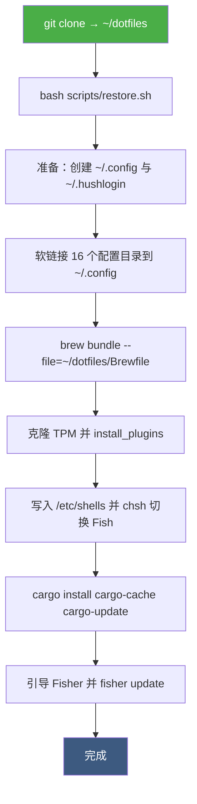
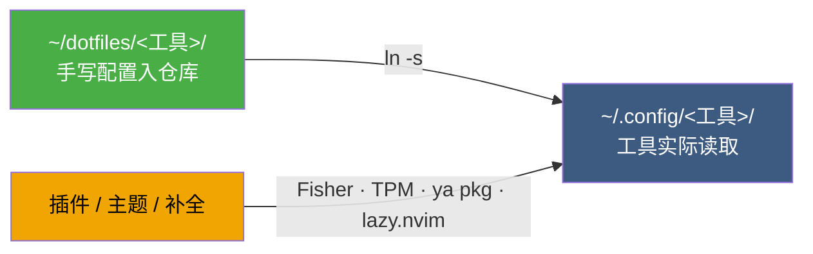

<div align="center">

# dotfiles

**Apple Silicon macOS 的个人配置仓库**

终端 `Ghostty` · Shell `Fish` · 编辑器 `Neovim` · 提示符 `Starship` · 包管理 `Homebrew`

一份「手写配置进仓库，插件主题交给包管理器」的 dotfiles：仓库里只放我真正手写的部分，其余全部由 `.gitignore` 排除、按需恢复。

[](https://www.apple.com/macos/)
[](https://fishshell.com/)
[](https://neovim.io/)
[](https://ghostty.org/)
[](https://brew.sh/)
[](https://github.com/fluxixix/dotfiles/commits/main)
[](https://github.com/fluxixix/dotfiles/stargazers)

</div>

## 📖 目录

- [快速开始](#-快速开始)
- [目录结构](#-目录结构)
- [技术栈](#-技术栈)
- [部署流程](#-部署流程)
- [配置怎么落到 `~/.config`](#-配置怎么落到-config)
- [常用操作](#️-常用操作)
- [更新与维护](#-更新与维护)
- [设计取舍](#-设计取舍)

## 🚀 快速开始

前置条件：

- 安装 Homebrew 与 Git，并配置好 GitHub SSH 访问（`scripts/setup.sh` 可代为生成密钥并写入 `~/.ssh/config`；首次使用需先在 GitHub 添加公钥）。
- 登录 Mac App Store 账户，Brewfile 中包含 `mas` 应用。

克隆到 `~/dotfiles`——建议就用这个路径，`scripts/setup.sh` 固定按 `$HOME/dotfiles` 克隆并调用其中的 `restore.sh`：

```sh
git clone git@github.com:fluxixix/dotfiles.git ~/dotfiles
```

主路径是执行部署脚本：

```sh
bash ~/dotfiles/scripts/restore.sh
```

只想手动链接、不跑完整脚本的话，等价的 Fish 写法如下（目录清单与 `restore.sh` 一致）：

```fish
mkdir -p ~/.config
for dir in aerospace bat btop eza fish ghostty git go-musicfox lazygit mole neovide npm nvim starship tmux yazi
    ln -s ~/dotfiles/$dir ~/.config/$dir
end
```

Yazi 的插件与风味不在仓库内，需要单独恢复：

```fish
ya pkg install
```

## 📁 目录结构

| 目录 / 文件 | 内容 |
| --- | --- |
| [aerospace/](aerospace/) | AeroSpace 平铺窗口管理器配置（`aerospace.toml`，含启动时调起 borders、默认布局与归一化行为） |
| [bat/](bat/) | bat 主题（`themes/Catppuccin Mocha.tmTheme`）与默认 `--theme` 配置 |
| [btop/](btop/) | btop 资源监视器配置（`btop.conf`，greyscale 主题、`vim_keys`、预设布局） |
| [eza/](eza/) | eza 的文件类型与权限配色（`theme.yml`） |
| [fish/](fish/) | `config.fish`（环境变量、PATH、缩写、fzf、代理）与 `functions/`（`u`、`y`、`proxy`、`unproxy`、`ripgrep_search`）；`fish_plugins` 为 Fisher 插件清单 |
| [ghostty/](ghostty/) | Ghostty 终端配置（字体、主题、窗口、键位、剪贴板）与 `shaders/` 自定义光标着色器 |
| [git/](git/) | 用户信息、Delta、同步策略与全局忽略（`config`、`ignore`、`themes.gitconfig`） |
| [go-musicfox/](go-musicfox/) | go-musicfox 配置（`config.toml`） |
| [lazygit/](lazygit/) | lazygit 配置（`config.yml`，Delta pager 与主题色） |
| [neovide/](neovide/) | Neovide 配置（`config.toml`，字体、窗口、工作目录） |
| [npm/](npm/) | npm 配置（`npmrc`，缓存路径） |
| [nvim/](nvim/) | 基于 lazy.nvim 的 AstroNvim v5 配置（`init.lua`、`lua/`、`lazy-lock.json`） |
| [scripts/](scripts/) | 部署与维护脚本（`restore.sh`、`setup.sh`、隐私清理/配置脚本、rime 更新脚本） |
| [starship/](starship/) | Starship 提示符及各模块符号（`starship.toml`） |
| [tmux/](tmux/) | `tmux.conf`（前缀键、TPM 插件）与 `tmux.conf.local` |
| [yazi/](yazi/) | 文件管理器配置（`init.lua`、`keymap.toml`、`theme.toml`、`yazi.toml`、`package.toml`） |
| [Brewfile](Brewfile) | Homebrew、Cask、Mac App Store、VS Code、Cargo、uv 依赖清单 |

`yazi/plugins/`、`yazi/flavors/`、`fish/completions/`、`fish/conf.d/`、`fish/themes/`、`tmux/plugins/`、`mole/` 及部分 Fisher/fzf 生成的函数已在 `.gitignore` 中排除，需要由对应包管理器恢复。

## 🧰 技术栈

| 场景 | 选了谁 | 配置位置 |
| --- | --- | --- |
| 终端 | Ghostty（含自定义光标着色器） | [ghostty/](ghostty/) |
| Shell | Fish + Fisher 插件 | [fish/](fish/) |
| 提示符 | Starship | [starship/](starship/) |
| 多路复用 | tmux（前缀键 `Ctrl-A`）+ TPM | [tmux/](tmux/) |
| 编辑器 | Neovim（AstroNvim v5，lazy.nvim 管理） | [nvim/](nvim/) |
| GUI 编辑器 | Neovide | [neovide/](neovide/) |
| 文件管理 | Yazi、eza、bat | [yazi/](yazi/)、[eza/](eza/)、[bat/](bat/) |
| 搜索 | ripgrep + fzf（`Ctrl-G` 实时搜索） | [fish/functions/](fish/functions/) |
| 窗口管理 | AeroSpace + borders | [aerospace/](aerospace/) |
| 版本控制 | git + Delta + git-lfs | [git/](git/) |
| 语言运行时 | Go、Rust（rustup）、Node（npm/pnpm）、Python（uv）、OpenJDK | [Brewfile](Brewfile) |

完整的软件清单都在 [Brewfile](Brewfile) 里，包含 Homebrew formula、Cask 应用、VS Code 扩展、Cargo 与 uv 工具。

## 🔗 部署流程



脚本以 `set -Eeuo pipefail` 运行，任一步失败即中止；只有软链接步骤例外——目标已被非软链接的现有文件或目录占用时会警告并跳过，继续执行后续步骤。

需要手动完成或授权的环节：

- 写入 `/etc/shells` 与 `chsh` 需要 `sudo` 授权。
- Mac App Store 应用安装需要先登录账户。
- 首次使用需先配置 GitHub SSH 密钥。

## 📂 配置怎么落到 `~/.config`

仓库按「一个工具一个目录」组织，部署时每个目录对应一个软链接，工具直接读 `~/.config/<工具>/`：



这样改配置就是改仓库文件，`git status` 立刻能看到改动；反过来 `git pull` 之后也无需重新部署。

## ⌨️ 常用操作

以下缩写定义在 Fish 的 `config.fish` 中：

| 缩写 | 展开为 |
| --- | --- |
| `c` | `clear` |
| `s` | `exec fish` |
| `v` | `nvim` |
| `lg` | `lazygit` |
| `mf` | `musicfox` |
| `py` | `python` |
| `ip` | `ipconfig getifaddr en0` |
| `copy` | `pbcopy` |
| `ports` | `lsof -i -P \| grep -i "listen"` |
| `qc` | `qoderclicn` |
| `claude` | `claude --dangerously-skip-permissions` |
| `xcode-clt` | `sudo xcode-select -s /Library/Developer/CommandLineTools` |
| `xcode-app` | `sudo xcode-select -s /Applications/Xcode.app/Contents/Developer` |
| `bi` / `bri` / `bui` | `brew install` / `brew reinstall` / `brew uninstall --zap` |
| `bs` / `bif` | `brew search` / `brew info` |
| `bl` | `brew leaves; and brew list --cask` |
| `bd` | `brew deps --installed --tree` |
| `bu` | `brew update; and brew upgrade; and brew upgrade --cask --greedy` |
| `bc` | `brew autoremove; and brew cleanup --prune=all` |
| `ts` / `tls` / `tn` / `tk` / `ta` | `tmux source-file ~/.config/tmux/tmux.conf` / `tmux ls` / `tmux new -s` / `tmux kill-session -t` / `tmux attach` |
| `trw` / `trs` | `tmux rename-window` / `tmux rename-session` |
| `yau` / `yaa` / `yad` / `yal` | `ya pkg upgrade` / `ya pkg add` / `ya pkg delete` / `ya pkg list` |
| `el` | `eza --long --header --icons --git --all` |
| `et` | `eza --tree --level=2 --long --header --icons --git` |
| `pon` / `poff` | `proxy` / `unproxy`（设置/清除 Clash 代理环境变量） |

函数与按键：

| 命令 / 按键 | 功能 |
| --- | --- |
| `y` | 打开 Yazi，退出后切换到其中选定的目录 |
| `Ctrl-G` | 调用 `ripgrep_search`，用 ripgrep 和 fzf 实时搜索；`Ctrl-O` 在编辑器（`$EDITOR`，默认 nvim）中打开匹配位置 |
| `u` | 统一更新全局工具、应用、tmux 与 Yazi 插件，并执行清理 |

tmux 以前缀键 `Ctrl-A` 为主：`=` / `-` 水平/垂直分屏，`c` 新建窗口，`r` 进入调整大小模式后按 `h/j/k/l` 调整、`q` 或 `Escape` 退出，`R` 重新加载配置。鼠标已启用，窗口与窗格序号从 1 开始。

## 🔄 更新与维护

`u` 会就地更新以下内容，某一项失败会继续执行其余独立步骤，并累计失败次数：

- Homebrew：`brew update` / `upgrade` / `upgrade --cask --greedy` / `autoremove` / `cleanup --prune=all`（不再自动重写 `Brewfile`）。
- Neovim：`Lazy! sync`、`AstroUpdate`、`MasonToolsUpdate`、`TSUpdateSync`。
- Go：遍历 `GOPATH/bin` 中的可执行文件，重新 `go install <pkg>@latest`。
- Rust：`rustup update`、`cargo install-update -a`、`cargo cache --autoclean`。
- Node：`npm update -g`、`npm cache clean --force`、`pnpm update -g`、`pnpm store prune`。
- Python：`uv tool upgrade --all`。
- Fisher：`fisher update`。
- tmux：逐个插件执行 `git pull --ff-only` 与子模块更新。
- Yazi：`ya pkg upgrade`，失败最多重试 3 次。
- Mac App Store：`mas upgrade`；Mole：`mo clean` 与 `mo purge`；并清理 CleanShot 的媒体缓存。

结尾会输出 `✓ All updated` 或 `✗ Update finished with N failure(s)`，以失败计数汇总结果（函数本身不会返回非零退出码）。`u` 不会拉取本仓库，配置同步需自行执行 Git 操作。

## 💡 设计取舍

**仓库只放手写配置。** 由包管理器分发的插件、flavor、补全与主题（见上方 `.gitignore` 说明）不入库，交给 Fisher / TPM / `ya pkg` / lazy.nvim 各自恢复。仓库因此保持小而可读，代价是首次部署多几步。

**一个工具一个目录，一个软链接。** 目录名与 `~/.config` 下的名字一一对应，不写映射表、不做条件分支，新增工具只是往 `restore.sh` 的清单里加一个名字。

**`u` 失败不中断。** 每个步骤独立执行、分别计数，最后统一汇总 `✓` / `✗`，避免某一步网络超时就让整轮更新白跑。

**`Brewfile` 由手工维护。** `u` 不再自动生成它，新增或移除依赖需要手动编辑，并为非官方 tap 保留 `trusted: true`。

**配置按功能分组。** 文件内标题沿用 `# ── 类别 ──` 的注释样式（见 `fish/config.fish`、`fish/functions/u.fish`）。
